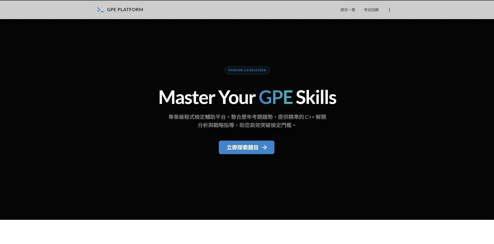
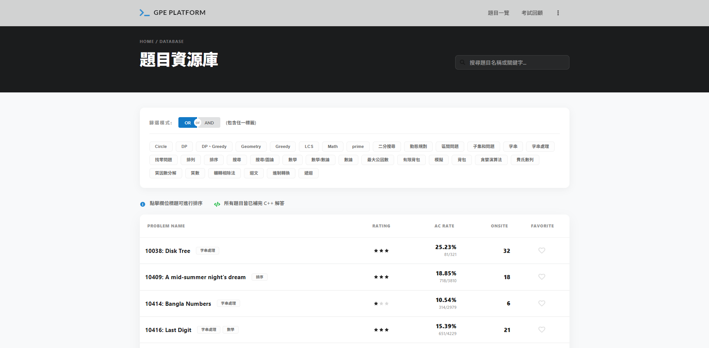
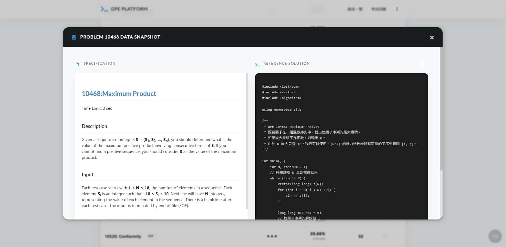

## Website Link
<p align="center">
<a href="https://gau132.github.io/gpe-helper2.0/" target="_blank">

</a>
</p>

## About

準備GPE時，剛好還剩很多token可以用，就讓gemini把所有題目都分類並寫好，然後就真的過了。

心情很好，想說都做了就發出來一起用，希望大家都可以順利通過，早日畢業。

## Feature

- 2018~今每次考試歷史出題一覽
- 2019~今所有題目一覽
- AC 率、OnSite 次數、題目 Access 次數等欄位排序
- 瀏覽器儲存我的最愛題目
- 題目小分類處理
- 不負責任題目推薦度計算
- 題目快照功能 (Thanks @takidog)
- (新增) 題目標籤分類
- (新增) 題目參考答案

## Screenshots




## Development

詳見 `pybin` `frontend` 資料夾裡面 README

## 部署方法

### 1. 本地使用 (如何開啟)

**前端網頁：**
```bash
cd frontend
npm install
npm run start # <--- 執行此指令開啟網頁
```

**爬蟲與資料處理：**
詳見 `pybin/README.md`。

## Other

我在這個專案使用gemini cli來撰寫所有答案，
答案可能會有誤，僅供參考。
如果喜歡這個專案，或是覺得這專案有小小幫助到你，歡迎給我個 ⭐ 支持。也可以去原作者的github按個star ⭐ 。

## Acknowledgements

這個專案是fork from setsal/GPE-Helper. 特別感謝他提供了題目，讓很多交大人都能順利考過。

對專案開發心得可見原作者的 blog [https://blog.setsal.dev/gpe-helper/](https://blog.setsal.dev/gpe-helper/)